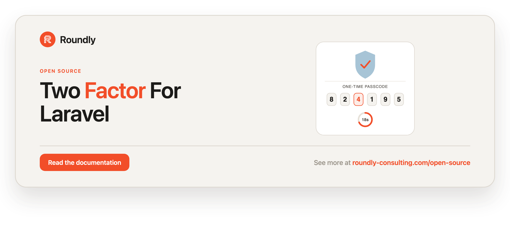

<!-- roundly-hero:start -->
<p align="center">
  <a href="https://roundly-consulting.com/open-source/docs/two-factor-for-laravel?utm_source=github&utm_medium=readme&utm_campaign=open-source&utm_content=two-factor-for-laravel">
    
  </a>
</p>
<!-- roundly-hero:end -->

# Two-Factor Authentication for Laravel

Native RFC 6238 TOTP two-factor authentication for Laravel — encrypted secrets, single-use
recovery codes and replay protection, with **zero third-party crypto dependencies**. QR
rendering is up to you: draw it client-side from the `otpauth://` URI, or server-side as an SVG
with our native [qr-for-laravel](https://github.com/roundly-consulting/qr-for-laravel). No image
library ships in this package.

- RFC 4226 / RFC 6238 TOTP and the RFC 4648 base32 codec, from our own
  [crypto-for-laravel](https://github.com/roundly-consulting/crypto-for-laravel).
- Constant-time verification and replay protection (a code can't be reused).
- Encrypted TOTP secret and hashed (one-way) recovery codes at rest, both hidden from serialization.
- Ergonomic surface: a `TwoFactor` facade, lifecycle Actions, a user-model trait, and events.
- **Standards-compatible** — existing TOTP secrets from standard authenticator apps keep verifying unchanged.

## Requirements

- PHP `^8.4`
- Laravel `^12.0 | ^13.0`

## Integrates with

- **[crypto-for-laravel](https://github.com/roundly-consulting/crypto-for-laravel)** — a hard
  dependency that owns every cryptographic primitive this package uses: the HOTP/TOTP maths
  (`Crypto\Otp\Totp`), the `otpauth://` provisioning URI, the strict base32 codec
  (`Crypto\Codec\Base32`), the CSPRNG secret generator (`Crypto\Random\Secret`), and the
  constant-time comparison. Nothing crypto is re-implemented here; this package owns the
  Laravel-side ceremony — enrolment, confirmation, replay guards, recovery codes, rate
  limiting, and the encrypted-at-rest columns.

  Crypto is **zero-config**: this package's own `config/two-factor.php` (algorithm, digits,
  period, window, secret length) still drives everything, and every failure is translated back
  into a `TwoFactorException` — a malformed secret still surfaces as `InvalidBase32Exception`,
  a bad code as `InvalidTwoFactorCodeException`, a bad setting as
  `InvalidTwoFactorConfigException`.

- **[package-toolkit-for-laravel](https://github.com/roundly-consulting/package-toolkit-for-laravel)**
  — a hard dependency that provides the service-provider base this package is built on: the
  config merge/publish wiring, the publish-only migration handling, and the
  `php artisan about --only=two-factor` section (which reports the TOTP parameters, the replay
  guard and the attempt limit — never a secret, a recovery code, the issuer or a store name).

- **[qr-for-laravel](https://github.com/roundly-consulting/qr-for-laravel)** — **optional
  (`suggest`)**, never installed by this package. Add it to your app to render the enrolment
  `otpauth://` URI as an SVG QR code server-side — see
  [Rendering the QR code](#rendering-the-qr-code). Two-factor itself stays QR-free.

## Installation

```bash
composer require roundly-consulting/two-factor-for-laravel
```

**Migrations are publish-only** — nothing is auto-loaded from the package, so publish the
migration (it stamps its own timestamp on publish) and then migrate:

```bash
php artisan vendor:publish --tag="two-factor-migrations"
php artisan migrate
```

Re-publishing overwrites the file it published to last time, so you never end up with two
copies of the same migration.

The migration adds four nullable columns to your `users` table — or to the table named by
`two-factor.table` (`TWO_FACTOR_TABLE`), read when the migration runs. If you write your own
migration instead, use the Blueprint macro:

```php
Schema::table('users', function (Blueprint $table): void {
    $table->twoFactorColumns(); // secret, recovery_codes, confirmed_at, last_used_timestep
});
```

### Other account tables

Two-factor works on any Eloquent model that uses the trait — `clients`, `admins`, one per
guard. The published migration covers one table; give every further account table the same
columns in your own migration with the macro:

```php
Schema::table('clients', function (Blueprint $table): void {
    $table->twoFactorColumns();
});
```

Column names come from the shared `two-factor.columns` map, and the built-in limiter keys on
the model class as well as the id, so a user and a client with the same id never share a
lockout.

Optionally publish the config file:

```bash
php artisan vendor:publish --tag="two-factor-config"
```

The package works with **zero configuration** — every key has a safe default.

## Configuration

`config/two-factor.php`:

```php
return [
    // TOTP parameters — defaults match standard authenticator apps (RFC 6238).
    // Bounds are enforced at runtime; out-of-range values throw
    // InvalidTwoFactorConfigException rather than silently weakening 2FA.
    'algorithm' => 'sha1',        // 'sha1' | 'sha256' | 'sha512'
    'digits' => 6,                // 6–8
    'period' => 30,               // 15–120 seconds per timestep
    'window' => 1,                // 0–2: accept ±N timesteps of drift
    'secret_length' => 32,        // base32 chars (≥16); 32 = 160 bits

    // Provisioning (otpauth:// URI). issuer falls back to config('app.name') at runtime.
    'issuer' => env('TWO_FACTOR_ISSUER'),

    'recovery_codes' => [
        'count' => 8,
        'storage' => 'hashed',    // 'hashed' (default) | 'encrypted'
    ],

    // Built-in brute-force limiter for verifyFor(), keyed per user. Set to null
    // to disable it and rely on your own throttle middleware instead.
    'attempts' => [
        'max' => 5,               // failed attempts before lockout
        'decay' => 60,            // seconds the lockout lasts
    ],

    // Replay protection: reject any code whose timestep <= the last successful one.
    'replay_guard' => 'column',   // 'column' | 'cache' | 'none' (null → none)
    'cache' => [
        'store' => env('TWO_FACTOR_CACHE_STORE'),
        'ttl' => 60 * 60 * 24,
    ],

    // The table the published migration adds the columns to. Other account
    // tables get them via `$table->twoFactorColumns()` in your own migration.
    'table' => env('TWO_FACTOR_TABLE', 'users'),

    // Column names on the host account table(s) — remap for non-standard schemas.
    'columns' => [
        'secret' => 'two_factor_secret',
        'recovery_codes' => 'two_factor_recovery_codes',
        'confirmed_at' => 'two_factor_confirmed_at',
        'last_used_timestep' => 'two_factor_last_used_timestep',
    ],
];
```

| Key | Type | Default | Purpose |
|---|---|---|---|
| `algorithm` | string | `sha1` | HMAC hash; `sha1` for authenticator-app compatibility |
| `digits` | int | `6` | Code length (6–8) |
| `period` | int | `30` | Seconds per timestep (15–120) |
| `window` | int | `1` | Accepted drift in ± timesteps (0–2) |
| `secret_length` | int | `32` | Base32 secret length (≥16); 32 chars = 160 bits |
| `issuer` | string\|null | `env('TWO_FACTOR_ISSUER')` | Provisioning issuer; null or blank falls back to `config('app.name')` |
| `recovery_codes.count` | int | `8` | Recovery codes generated per enrolment |
| `recovery_codes.storage` | string | `hashed` | `hashed` (one-way, default) or `encrypted` (reversible, display-again) |
| `attempts` | array\|null | `['max' => 5, 'decay' => 60]` | Built-in per-user brute-force limiter; `null` disables it |
| `attempts.max` | int | `5` | Failed attempts before lockout |
| `attempts.decay` | int | `60` | Seconds the lockout lasts |
| `replay_guard` | string\|null | `column` | Last-used-timestep store: `column`, `cache`, or `none`/`null` |
| `cache.store` | string\|null | `env('TWO_FACTOR_CACHE_STORE')` | Cache store for the `cache` guard |
| `cache.ttl` | int | `86400` | Seconds to retain the last timestep in `cache` mode |
| `table` | string | `env('TWO_FACTOR_TABLE', 'users')` | Table the published migration alters; blank falls back to `users` |
| `columns.*` | string | — | Column names on every two-factor account table |

The `replay_guard` and `recovery_codes.storage` values are backed by the `ReplayGuardMode` and
`RecoveryCodeStorage` enums, and `algorithm` by crypto's `Otp\OtpAlgorithm` (`sha1` | `sha256` |
`sha512`) — an unknown value throws `InvalidTwoFactorConfigException` at resolution, never a
silent hash downgrade.

**Env vars:** `TWO_FACTOR_ISSUER`, `TWO_FACTOR_CACHE_STORE`, `TWO_FACTOR_TABLE`.

## Host model setup

Implement the contract, use the trait, and spread `twoFactorCasts()` into your model's casts:

```php
use Illuminate\Foundation\Auth\User as Authenticatable;
use RoundlyConsulting\TwoFactor\Concerns\HasTwoFactorAuthentication;
use RoundlyConsulting\TwoFactor\Contracts\TwoFactorAuthenticatable;

final class User extends Authenticatable implements TwoFactorAuthenticatable
{
    use HasTwoFactorAuthentication;

    protected function casts(): array
    {
        return [
            // ...your other casts
            ...$this->twoFactorCasts(),
        ];
    }
}
```

## Usage

### Enrol

```php
use RoundlyConsulting\TwoFactor\Actions\StartEnrolment;

$setup = app(StartEnrolment::class)->execute($user);

$setup->secret;          // base32 secret (store is handled for you)
$setup->provisioningUri; // otpauth://totp/Acme:user@acme.io?secret=...&issuer=Acme&...
$setup->recoveryCodes;   // list<string> — show these once, they are the only plaintext copy
$setup->issuer;          // the issuer the URI carries — show it next to the QR
```

The issuer defaults to `two-factor.issuer`, then `app.name` (a blank value at either level counts
as unset). Brand it per call — one name per guard or tenant — with the `issuer` argument:

```php
$setup = app(StartEnrolment::class)->execute($client, issuer: 'Acme Partner Portal');
```

### Rendering the QR code

This package never renders a QR image — it hands you `$setup->provisioningUri`. Draw it
wherever suits your stack.

**Server-side (SVG)** — install our native
[qr-for-laravel](https://github.com/roundly-consulting/qr-for-laravel)
(`composer require roundly-consulting/qr-for-laravel`) and render the URI in one call:

```php
use RoundlyConsulting\Qr\Enums\ErrorCorrection;
use RoundlyConsulting\Qr\Facades\Qr;

$setup = $user->startTwoFactorEnrolment();

$svg = Qr::otpauth($setup->provisioningUri)
    ->size(240)
    ->errorCorrection(ErrorCorrection::Medium)
    ->title(__('Scan with your authenticator app'))
    ->svg();

// Blade:       {{ $svg }}  — renders the SVG markup; show {{ $setup->issuer }} next to it
// JSON API:    ['qr' => $svg->toDataUri(), 'issuer' => $setup->issuer]
// Controller:  return $svg;  — an image/svg+xml response
// Raw markup:  $svg->toString()
```

`Qr::otpauth()` encodes the URI **unchanged** and treats it as a secret: never memoised or
cached, served with `Cache-Control: no-store` and no ETag. The code carries the TOTP secret —
show it on the enrolment screen only; never persist, log or e-mail the SVG.

**Client-side** — pass `$setup->provisioningUri` to your front end and draw it there (e.g.
`qrcode.js`, `react-qr-code`). Send it over the same authenticated response as the rest of the
enrolment screen, and don't keep it once enrolment is confirmed.

### Confirm

The user scans the code and submits the first 6-digit code to finish enrolment:

```php
use RoundlyConsulting\TwoFactor\Actions\ConfirmEnrolment;

app(ConfirmEnrolment::class)->execute($user, $request->string('code')->toString());
// throws InvalidTwoFactorCodeException on a wrong code,
// TwoFactorNotPendingException if there is no pending enrolment — including when 2FA is
// already enabled: a confirm is never a silent no-op, so a clean return always means this
// code just switched 2FA on.
```

### Verify during login

```php
use RoundlyConsulting\TwoFactor\Exceptions\TwoFactorRateLimitedException;
use RoundlyConsulting\TwoFactor\Facades\TwoFactor;

try {
    if (TwoFactor::verifyFor($user, $request->string('code')->toString())) {
        // accepted — TOTP (replay-safe) or a single-use recovery code
    }
} catch (TwoFactorRateLimitedException $e) {
    // too many failed attempts — retry after $e->secondsUntilAvailable seconds
}
```

Need to know **how** the challenge was passed? `attempt()` runs the exact same checks and
returns a `VerificationResult` instead of a bool:

```php
use RoundlyConsulting\TwoFactor\Enums\TwoFactorMethod;

$result = TwoFactor::attempt($user, $request->string('code')->toString());

$result->verified;               // bool — same answer verifyFor() gives
$result->method;                 // TwoFactorMethod::Totp | ::RecoveryCode | null on failure
$result->remainingRecoveryCodes; // int, after this attempt — "1 recovery code left"
$result->replayed;               // true when a valid code's timestep was already used

if ($result->method === TwoFactorMethod::RecoveryCode) {
    // e.g. notify the user, add 'recovery_code' to an amr claim
}
```

The remaining count after a recovery code is read from the row locked for the spend, so it is
correct even when two requests race.

`verifyFor()` (and `attempt()`) checks the TOTP code with replay protection first, then falls back to a
single-use recovery code (consuming it). A code whose timestep was already used is rejected,
and so is any code for a user whose enrolment is still **pending** (`confirmed_at` unset) —
only a confirmed second factor can satisfy a challenge.

**Built-in brute-force limiter.** `verifyFor()` throttles per user out of the box: after
`attempts.max` (default 5) failed attempts within `attempts.decay` seconds (default 60) it
throws `TwoFactorRateLimitedException` before doing any verification work, and dispatches a
`TwoFactorRateLimited` event. A successful verification clears the counter. Set
`config('two-factor.attempts')` to `null` to disable it entirely and use your own `throttle:`
middleware instead.

### Disable & regenerate

```php
use RoundlyConsulting\TwoFactor\Actions\DisableTwoFactor;
use RoundlyConsulting\TwoFactor\Actions\RegenerateRecoveryCodes;

app(DisableTwoFactor::class)->execute($user);          // clears all 2FA state
$codes = app(RegenerateRecoveryCodes::class)->execute($user); // returns the new codes
```

### On the user model (trait verbs)

`HasTwoFactorAuthentication` also exposes the whole lifecycle on the user itself, so the
model is the subject of the action — no container-resolved action needed:

```php
$setup  = $user->startTwoFactorEnrolment();          // → TwoFactorSetup
$user->confirmTwoFactor($code);                      // finish enrolment
$ok     = $user->verifyTwoFactorCode($code);         // login challenge (== TwoFactor::verifyFor)
$result = $user->attemptTwoFactorCode($code);        // → VerificationResult (== TwoFactor::attempt)
$user->disableTwoFactor();
$codes  = $user->regenerateTwoFactorRecoveryCodes(); // list<string>

$user->twoFactorRecoveryCodesRemaining();            // int — drive a "regenerate?" prompt
```

Pass a label and/or an issuer —
`startTwoFactorEnrolment('billing@acme.io', issuer: 'Acme Billing')` — or override
`twoFactorLabel()` on the model to key the provisioning URI on a username/phone instead of
the default (email → primary key).

### Facade primitives

```php
$secret = TwoFactor::generateSecret();                          // base32
$code   = TwoFactor::currentCode($secret);                      // current 6-digit code
$step   = TwoFactor::verify($secret, $code);                    // int timestep | false
$result = TwoFactor::attempt($user, $code);                     // VerificationResult
$uri    = TwoFactor::provisioningUri($secret, 'user@acme.io');  // otpauth:// URI
$codes  = TwoFactor::generateRecoveryCodes();                   // list<string>
```

## Security

- **Encrypted secret at rest** — the TOTP secret is stored through Laravel's `encrypted` cast
  (your `APP_KEY`). Recovery codes are **hashed** one-way by default (see below).
- **Hidden from serialization** — the trait pushes `two_factor_secret`,
  `two_factor_recovery_codes`, and `two_factor_last_used_timestep` into the model's `$hidden`
  automatically, so `return $user;` from a route or `$user->toArray()`/`toJson()` never leaks
  the decrypted secret or codes. (`two_factor_confirmed_at` stays visible for UI state.)
- **Constant-time compare** — every code comparison goes through crypto's `ConstantTime`; the
  package never uses `===`, `md5`, or `sha1` for comparisons.
- **Atomic replay protection** — the matched timestep is claimed in a single check-and-set, so
  two concurrent submissions of the same code cannot both succeed. Any code with a timestep
  `<=` the last successful one is rejected and a `TwoFactorReplayDetected` event fires. The
  code used to *confirm* enrolment is claimed too, so it cannot double as the first login code.
  For multi-node hosts, use the `cache` guard backed by an atomic store (Redis / database).
- **Atomic single-use recovery codes** — consumption re-reads the row under a transaction lock
  before removing the matched code, so a code phished once cannot be raced through twice.
- **Built-in brute-force limiter** — `verifyFor()` ships a per-user throttle on by default
  (`attempts.max` / `attempts.decay`), throwing `TwoFactorRateLimitedException` on lockout. Set
  `attempts` to `null` to opt out and run your own `throttle:` middleware.
- **Bounds-checked config** — `digits` (6–8), `period` (15–120), `window` (0–2) and
  `secret_length` (≥16) are validated at runtime; a misconfiguration throws
  `InvalidTwoFactorConfigException` instead of silently degrading to weak 2FA.
- `#[SensitiveParameter]` is applied to every secret/code argument so they never leak into
  stack traces; the package never logs secrets or codes.

### Hashed vs. encrypted recovery codes

The default `hashed` mode stores one-way `Hash::make()` hashes — a database dump plus a leaked
`APP_KEY` never yields live recovery codes. The opt-in `encrypted` mode keeps the plaintext
codes encrypted at rest so a host can display them again after enrolment, at the cost of being
reversible with `APP_KEY`. **Switching modes invalidates existing stored codes** — only change
`recovery_codes.storage` on a fresh enrolment base, and regenerate codes for enrolled users if
you switch.

### Cache replay-guard caveat

The `cache` guard claims each timestep atomically via the store's lock (Redis, Memcached,
database, file, array all provide one). Be aware that a cache flush or eviction (`cache:clear`,
a deploy, LRU pressure) drops the last-used timestep and momentarily reopens the replay window.
Where that risk is unacceptable, use the default `column` guard, which persists to the users
table.

## Events

All events carry the user model (never a secret or a code); a few add a non-sensitive detail:

| Event | Fired when |
|---|---|
| `TwoFactorEnrolmentStarted` | `StartEnrolment` persists a pending secret |
| `TwoFactorConfirmed` | `ConfirmEnrolment` enables 2FA |
| `TwoFactorDisabled` | `DisableTwoFactor` clears 2FA state |
| `RecoveryCodesRegenerated` | `RegenerateRecoveryCodes` replaces the code set |
| `RecoveryCodeConsumed` | `attempt`/`verifyFor` burns a recovery code (carries `remaining`, the count left) |
| `TwoFactorVerified` | a user passes a challenge (carries `method`: `TwoFactorMethod::Totp` or `::RecoveryCode`) |
| `TwoFactorVerificationFailed` | an enrolled user fails a challenge (not on replay/no-secret) |
| `TwoFactorReplayDetected` | a code with an already-used timestep is rejected |
| `TwoFactorRateLimited` | the built-in limiter locks a user out (carries `secondsUntilAvailable`) |

`TwoFactorVerified` / `TwoFactorVerificationFailed` let you audit challenges, meter
success/failure rates, and drive host-side lockout without wrapping the facade — e.g. a
listener that records a `LoginAttempt` or increments a rate limiter:

```php
Event::listen(function (TwoFactorVerificationFailed $event): void {
    RateLimiter::hit("2fa:{$event->user->getKey()}");
});
```

## Migrating from another TOTP library

This package is **byte-compatible** with the standard TOTP profile (SHA1, 6 digits, 30s) used
by common authenticator apps and libraries. Existing secrets keep verifying under the same
`APP_KEY` with no data migration — just add the `two_factor_last_used_timestep` column (via the
macro/migration) to enable replay protection. If you are importing existing plaintext/encrypted
recovery codes, set `recovery_codes.storage` to `encrypted` so they still match (the default is
`hashed`).
Compatibility is proven by committed static parity fixtures; no third-party TOTP library is a
dependency of this package.

## Testing

```bash
composer test
```

### Faking two-factor in host tests

`TwoFactor::fake()` swaps the service (and every action that depends on it) for a
programmable, no-crypto double, so you can assert your 2FA flow without freezing the clock
or computing real codes:

```php
use RoundlyConsulting\TwoFactor\Facades\TwoFactor;

// Accept any code (the default) and assert the challenge was verified:
$fake = TwoFactor::fake()->accept();
$this->post('/login/2fa', ['code' => '123456'])->assertOk();
$fake->assertVerifiedFor($user);

// Reject every code:
TwoFactor::fake()->reject();
$this->post('/login/2fa', ['code' => '000000'])->assertStatus(422);

// Accept only a specific code:
TwoFactor::fake()->acceptCode('424242');

// Drive attempt(): pass via a recovery code, report 2 left, assert the method:
$fake = TwoFactor::fake()->acceptRecoveryCode()->withRemainingRecoveryCodes(2);
$fake->assertVerifiedVia(TwoFactorMethod::RecoveryCode);

// Fail as a replay (VerificationResult::$replayed === true):
TwoFactor::fake()->replay();
```

Programmable behaviour: `accept()` (passes via TOTP), `acceptRecoveryCode()`, `reject()`,
`replay()`, `acceptCode($code)`, `withRemainingRecoveryCodes($n)` (unset, the fake reports the
user's stored count, one lower when a recovery code passes), `withSecret($secret)`,
`withRecoveryCodes(...$codes)`. `attempt()` and `verifyFor()` are recorded alike. Assertions
(each throws a package exception, so they work under any runner): `assertVerified()`,
`assertVerifiedFor($user)`, `assertVerifiedVia($method)`,
`assertVerificationFailed()`, `assertNothingVerified()`, `assertVerifyCount($n)`,
`assertCodeAttempted($code)`. The fake is test-only and performs no TOTP math — it is bound
solely through `TwoFactor::fake()` and never in production.

## Changelog

See [CHANGELOG.md](CHANGELOG.md).

## License

The MIT License (MIT). Please see [LICENSE.md](LICENSE.md). Maintained by roundly-consulting.
